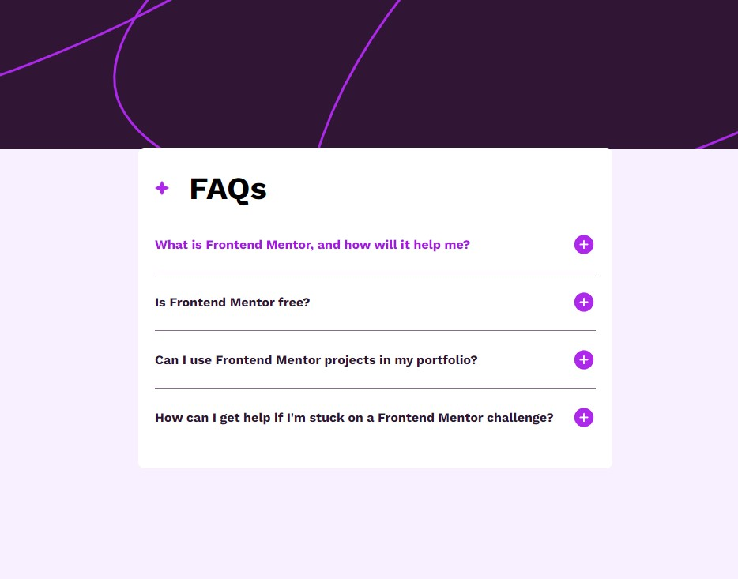

# Frontend Mentor - FAQ Accordion Solution

This is my solution to the [FAQ accordion challenge on Frontend Mentor](https://www.frontendmentor.io/challenges/faq-accordion-wyfFdeBwBz). The challenge helped me improve the accessibility of my website and practice unit testing, following a mobile-first approach.

## Table of Contents

- [Frontend Mentor - FAQ Accordion Solution](#frontend-mentor---faq-accordion-solution)
  - [Table of Contents](#table-of-contents)
  - [Overview](#overview)
    - [The Challenge](#the-challenge)
    - [Screenshot](#screenshot)
    - [Links](#links)
  - [My Process](#my-process)
    - [Built With](#built-with)
    - [What I Learned](#what-i-learned)
  - [Author](#author)

## Overview

### The Challenge

Users should be able to:

- Hide/Show the answer to a question when the question is clicked.
- Navigate the questions and hide/show answers using keyboard navigation alone.
- View the optimal layout for the interface depending on their device's screen size.
- See hover and focus states for all interactive elements on the page.

### Screenshot

### Links

- **Solution URL:** [Github](https://github.com/SecretariatV/FM-FAQ)
- **Live Site URL:** [Live](https://secretariatv.github.io/FM-FAQ/)

## My Process

### Built With

- **Semantic HTML5 markup**
- **CSS custom properties**
- **Flexbox**
- **CSS Grid**
- **Mobile-first workflow**
- [**React**](https://reactjs.org/)
- [**SASS**](https://sass-lang.com/)
- [**Vitest**](https://vitest.dev/)

### What I Learned

- **Accessibility Enhancements:** Improved the user experience by implementing keyboard navigation, ensuring that users can interact with the FAQ component using just their keyboard.
- **Test-Driven Development (TDD):** Adopted a TDD mindset by writing unit tests before implementing features. This approach helped ensure code reliability and maintainability.
- **Unit Testing:** Gained hands-on experience in writing unit tests using `testid` attributes, which facilitated testing of interactive elements.

## Author

- **Website:** [Oliver Boucher](https://ovb-portfolio.vercel.app)
- **Frontend Mentor:** [@SecretariatV](https://www.frontendmentor.io/profile/SecretariatV)
- **Twitter:** [@ovb_coder](https://www.twitter.com/ovb_coder)